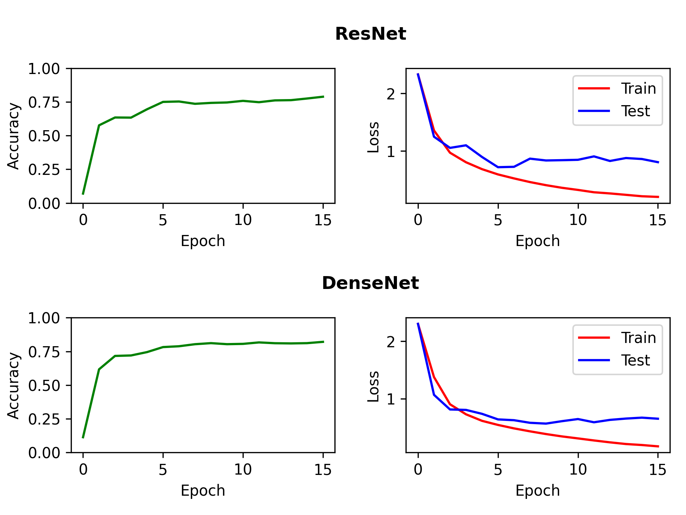

# Interpretation 

- Both networks have approximately the similar amount of parameters
- Both networks have also reached an accuracy of about ~80%
- Both architectures are comparatively good considering accuracy
- Skip connection aka shortcut applied in form of adding (ResNet) or concatenating (DenseNet) the output of a 'previous' layer to the current layer has the same effect on the accuracy.
- These skip connections allow us to train deeper neural networks -> Instead of applying chain rule, sum of derivative is used for determinating the gradient -> Prevent vanishing/exploding gradients ("sum instead of product")

## Neural Network Architectures

### ResNet


```console
Model: "res_net"
_________________________________________________________________
 Layer (type)                Output Shape              Param #   
=================================================================
 conv2d (Conv2D)             multiple                  1540      
                                                                 
 residual_block (ResidualBlo  multiple                 44125     
 ck)                                                             
                                                                 
 residual_block_1 (ResidualB  multiple                 54225     
 lock)                                                           
                                                                 
 residual_block_2 (ResidualB  multiple                 59885     
 lock)                                                           
                                                                 
 residual_block_3 (ResidualB  multiple                 70775     
 lock)                                                           
                                                                 
 residual_block_4 (ResidualB  multiple                 78045     
 lock)                                                           
                                                                 
 residual_block_5 (ResidualB  multiple                 89525     
 lock)                                                           
                                                                 
 global_average_pooling2d (G  multiple                 0         
 lobalAveragePooling2D)                                          
                                                                 
 dense (Dense)               multiple                  860       
                                                                 
=================================================================
Total params: 398,980
Trainable params: 396,340
Non-trainable params: 2,640
_________________________________________________________________
```

### DenseNet

```console
Model: "dense_net"
_________________________________________________________________
 Layer (type)                Output Shape              Param #   
=================================================================
 conv2d_22 (Conv2D)          multiple                  1540      
                                                                 
 dense_block (DenseBlock)    multiple                  73620     
                                                                 
 transition_layer (Transitio  multiple                 8320      
 nLayer)                                                         
                                                                 
 dense_block_1 (DenseBlock)  multiple                  115920    
                                                                 
 transition_layer_1 (Transit  multiple                 12640     
 ionLayer)                                                       
                                                                 
 dense_block_2 (DenseBlock)  multiple                  174150    
                                                                 
 transition_layer_2 (Transit  multiple                 20280     
 ionLayer)                                                       
                                                                 
 global_average_pooling2d_1   multiple                 0         
 (GlobalAveragePooling2D)                                        
                                                                 
 dense_1 (Dense)             multiple                  1010      
                                                                 
=================================================================
Total params: 407,480
Trainable params: 405,390
Non-trainable params: 2,090
_________________________________________________________________
```

## Results


