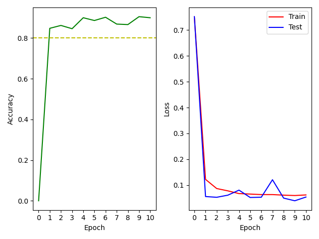

# Interpretation 

- After one epoch: Accuracy reached approximately 82%, the loss goes down from over 0.8 to under 0.1 -> Problem simple to learn for the RNN
- Futher epoches: slow reaching (converge) to 90% accuracy -> fine tuning of weights 

## Recurrent Neural Network Architecture

```console
Model: "my_model"
_________________________________________________________________
 Layer (type)                Output Shape              Param #   
=================================================================
 dense (Dense)               multiple                  64        
                                                                 
 lstm__layer (LSTM_Layer)    multiple                  53200     
                                                                 
 dense_5 (Dense)             multiple                  101       
                                                                 
=================================================================
Total params: 53,365
Trainable params: 53,365
Non-trainable params: 0
_________________________________________________________________

```

## Results



## Questions

### Can / should you use truncated BPTT here?
- Backpropagation through time (BPTT): Calculate loss for each time step (not only the last one) separately (unfolding the network)
- Network shares the same parameters -> Weight updates are summed up together
- Loss calculation for each time step -> Need labels for each time step
- Data format: ( [d1, d2, ... , dn] , target = 1 or 0 ) n time steps 
- There is only one target for the entire sequence
- BPTT not possible
- Can only backpropagate label for last time step over entire time sequence

### Should you rather take this as a regression, or a classification problem?

- **Regression**: Method for fitting a curve (linear, polynomial, expoential etc.) through a set of points using some goodness-of-fit criterion
- The problem solved by the RNN is **NOT** a regression.
- Not fitting a curve (here: discrete values 0 or 1)
- Curve is continuous
- However, it could be seen that: Set of points = time sequence, goodness-of-fit criterion = loss function
- **Classification**: Assign a discrete class (here: '0' or '1') to the data based on its attributes/values (here: value of each time step in the sequence)
- The problem solved by the RNN is a classification.
- RNN acts as a classifier: Maping time sequence to class '0' or '1'