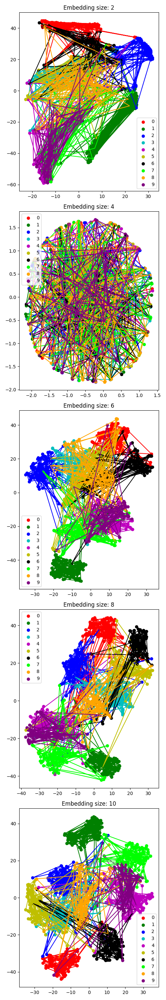

# Latent Space Analysis

- 4: Bad Init. 
- Increase of embedding size -> amount and size of overlapping regions decreases, distance between regions of different digits increases
- Clusters
- Relative position to other clusters changed with increasing embedding size