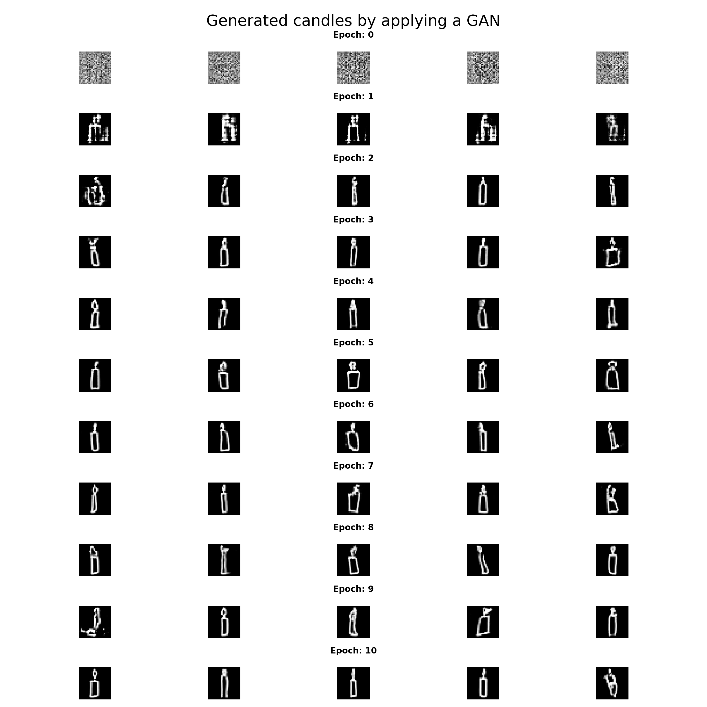
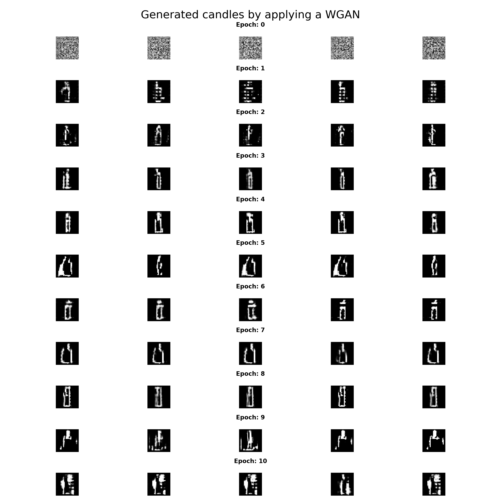

# IANNWTF - Homework 09

A GAN and a WGAN are implemented for generating drawn candle images based on the quickdraw dataset.


## Usage

### Start training

Run the `Training.py`. Before starting the training, the training data (including testing data) will be downloaded 
and stored in the `candle.npy` file (~100MB).
After training, a `GeneratedCandles.png` file will be created displaying five generated candle images per epoch.

```bash
python Training.py
```

### See training live results

Run `tensorboard` to inspect the current loss of the generator and discriminator (WGAN: critic) in the epoch including previous onces.
Furthermore, you can see the images created by the generator per epoch.
In case of the GAN, you can see the discriminator accuracy detecting fake and real images per epoch.

```bash
tensorboard --logdir ./test_logs/
```

## Results

### GAN



### WGAN



## Tricks and take home messages
- The generator must be "strong" i.e. containing more layers than the discriminator (critic).
- Sometimes train the generator "more" than the discriminator (critic) -> skip training discriminator (critic) (in this case).
- No bias for the generator